# Todo App — CI/CD POC (Jenkins → Docker Hub → Kubernetes)

A professional DevOps proof-of-concept demonstrating a Jenkins pipeline that builds a Docker image from a feature-rich Flask Todo application, pushes it to Docker Hub, and deploys to a local Kubernetes cluster (Minikube). The pipeline is triggered from GitHub (webhook) and runs on a local Jenkins instance at `http://localhost:8080`.

---

## Table of Contents
- [Project Overview](#project-overview)
- [Architecture](#architecture)
- [Sequence Diagram](#sequence-diagram)
- [Prerequisites](#prerequisites)
- [Repository layout](#repository-layout)
- [Local setup](#local-setup)
- [Jenkins setup](#jenkins-setup)
- [Kubernetes deployment](#kubernetes-deployment)
- [Triggering the pipeline](#triggering-the-pipeline)
- [Expected pipeline stages](#expected-pipeline-stages)
- [Troubleshooting](#troubleshooting)
- [Cleanup](#cleanup)

---

## Project overview
This repository demonstrates a professional CI/CD flow with a real-world Todo application:

- Source: GitHub (trigger via webhook)
- CI/CD: Jenkins Pipeline (defined in `Jenkinsfile`)
- Build: Docker image built from `Dockerfile`
- Registry: Docker Hub (image tagging and pushes from Jenkins)
- Deploy: Kubernetes (Minikube) via `kubectl` applied from Jenkins using a kubeconfig secret

The application is a feature-rich Flask Todo App (`app.py`) with SQLite database, CRUD operations, and responsive UI, listening on port `5000`.

---

## Architecture

```mermaid
flowchart TB
    %% =====================
    %% Row 1 — CI/CD Control
    %% =====================
    Dev[👨‍💻 Developer<br/>git push]
    GitHub[🐙 GitHub<br/>Repository]
    Jenkins[🧰 Jenkins<br/>CI/CD]
    DockerHub[🐳 Docker Hub<br/>mrlaw/todo_app]

    %% =====================
    %% Row 2 — Runtime Layer
    %% =====================
    subgraph K8s["☸️ Kubernetes (Minikube)"]
        Deploy[Deployment<br/>todo-app]
        Pod[Pod<br/>Flask App :5000]
        Service[Service<br/>NodePort 80 → 5000]
    end

    User[🌐 User Browser]

    %% ===== Control flow =====
    Dev -->|commit| GitHub
    GitHub -->|Webhook| Jenkins
    Jenkins -->|build & push image| DockerHub

    %% ===== Deploy flow =====
    Jenkins -->|kubectl apply| Deploy
    DockerHub -->|image pull| Deploy

    %% ===== Runtime traffic =====
    Deploy --> Pod
    Pod --> Service
    Service --> User
```



## Sequence Diagram


---

## Prerequisites

- Git
- Docker (required if Jenkins uses the local Docker daemon to build images)
- Minikube (local Kubernetes cluster)
- kubectl (configured locally for Minikube)
- Jenkins (accessible at `http://localhost:8080`)
- Docker Hub account
- GitHub repository and admin access (to create webhooks)

Notes:
- Jenkins agents executing the pipeline must have access to `docker` and `kubectl` (install or provide them in the agent container).
- The pipeline expects these credential IDs in Jenkins (see Jenkins setup): `docker_hub_pw`, `kubeconfig-minikube`.

---

## Repository layout

- `src/` — Source code
  - `app.py` — Flask Todo application with SQLAlchemy ORM (port `5000`)
  - `ngrok_github_webhook.py` — GitHub webhook automation for ngrok tunneling
  - `ngrok_server.py` — Local ngrok server helper
- `config/` — Configuration files
  - `.env.example` — Environment variables template
  - `requirements.txt` — Python dependencies
  - `k8s/` — Kubernetes manifests
    - `deployment.yaml` — Deployment manifest (uses placeholder `DOCKER_IMAGE`)
    - `service.yaml` — Service manifest (NodePort mapping to container port 5000)
- `docker/` — Docker configuration
  - `Dockerfile` — Container image builder
- `ci/` — CI/CD configuration
  - `Jenkinsfile` — Jenkins declarative pipeline for CI/CD
- `public/` — Frontend assets
  - `static/` — CSS styling for responsive UI
  - `templates/` — HTML templates (base.html, index.html, add_note.html)

Important resources in manifests:
- Deployment name: `todo-app`
- Service name: `todo-service`
- Container port: `5000`

---

## Local setup (run & test locally)

1. Clone repository

```bash
git clone https://github.com/mrlaw74/docker-k8s-ci-cd.git
cd docker-k8s-ci-cd
```

2. Run locally without Docker

```bash
python -m pip install -r config/requirements.txt
python src/app.py
# Open http://localhost:5000
```

3. Build & run with Docker

```bash
docker build -f docker/Dockerfile -t mrlaw/todo_app:local .
docker run --rm -p 5000:5000 mrlaw/todo_app:local
# Open http://localhost:5000
```

4. Deploy to Minikube for local verification

```bash
minikube start
kubectl apply -f config/k8s/
minikube service todo-service --url
# Or: kubectl port-forward svc/todo-service 8080:80
# Open the URL returned or http://localhost:8080
```

Note: `config/k8s/deployment.yaml` contains `image: DOCKER_IMAGE` which the pipeline replaces with the built image tag prior to `kubectl apply`.

---

## Jenkins setup (credentials, webhook, pipeline)

1. Jenkins and plugin requirements
   - Install Jenkins and plugins: Git, GitHub, Pipeline, Credentials, and any Docker/Kubernetes-related tools you need.

2. Credentials (create in Jenkins Credentials store)
   - Docker Hub token/password: **Secret text** or **Username/Password** credential
     - Example Jenkins credential ID used in `Jenkinsfile`: `docker_hub_pw` (string or secret)
   - Kubeconfig (Minikube) for Kubernetes access: **Secret File**
     - Example credential ID used in `Jenkinsfile`: `kubeconfig-minikube`

3. GitHub webhook
   - Add webhook in GitHub repo settings pointing to:
     `http://<jenkins-host>:8080/github-webhook/`
   - Trigger on `push` events (and optionally PR events)

4. Pipeline job
   - Create a Pipeline job that uses the repository and the included `Jenkinsfile`.
   - Set **Script Path** to `ci/Jenkinsfile` (pointing to the pipeline file location)
   - Ensure the job accepts GitHub webhooks (verify the GitHub plugin and webhook settings).

5. Verify environment variables in `Jenkinsfile`
   - `DOCKER_USER = "mrlaw"`, `DOCKER_IMAGE = "mrlaw/todo_app"`, and `IMAGE_TAG = "snapshot-${BUILD_NUMBER}"` are configured. Update to match your Docker Hub username if needed.

Security note: Use Jenkins credentials and avoid hardcoding secrets.

---

## Kubernetes deployment explanation

- Manifests: `config/k8s/deployment.yaml` and `config/k8s/service.yaml`.
  - `deployment.yaml` has a placeholder `DOCKER_IMAGE` that the pipeline replaces with the built image (`${DOCKER_IMAGE}:${IMAGE_TAG}`).
  - `service.yaml` exposes the app via a `NodePort` on port `80` → `targetPort: 5000`.
- Deployment strategy in the pipeline: modify manifest to reference the new image and run `kubectl apply -f config/k8s/deployment.yaml`.
- Access:
  - `minikube service todo-service --url` or `kubectl port-forward` for local testing.

For production-grade workflows, consider templating (Helm/Kustomize), health probes, and proper rollout/rollback strategies.

---

## How to trigger the pipeline

- Push to the GitHub repository (webhook triggers Jenkins).
- Manually trigger from Jenkins UI (Build Now).
- Configure PR-related triggers if you want builds on pull requests.

---
## Local webhook forwarding (ngrok)

For local Jenkins instances that are not reachable by GitHub, you can use ngrok to expose a local webhook endpoint and update the GitHub webhook automatically.

This repository includes `src/ngrok_github_webhook.py`, a small helper to:

- Create an ngrok tunnel and print the public URL
- Patch the GitHub webhook to point to the ngrok URL

Setup:

1. Copy `config/.env.example` to `config/.env` and fill in values (DO NOT COMMIT `config/.env`).
2. Install dependencies:

```bash
pip install pyngrok python-dotenv requests
```

3. Run the script:

```bash
python src/ngrok_github_webhook.py
```

Security and notes:

- The script reads sensitive tokens from environment variables (via `config/.env`) and will exit if required variables are missing.
- `.gitignore` already excludes `config/.env` and ngrok state files.
- For production, prefer using a secure secrets manager and avoid long-lived personal access tokens.

---
## Expected pipeline stages (from `Jenkinsfile`)

1. Checkout — pull the repository
2. Build Docker Image — `docker build -t ${DOCKER_IMAGE}:${IMAGE_TAG} .`
3. Docker Login — log in using `docker_hub_pw` credential
4. Push Docker Image — push tagged image and tag `latest`
5. Deploy to Kubernetes — replace `DOCKER_IMAGE` placeholder and `kubectl apply -f k8s/deployment.yaml`

These stages can be extended to include unit tests, container scans, linting, and integration tests.

---

## Troubleshooting (common issues & checks)

- Webhook not triggering:
  - Check GitHub webhook delivery logs and Jenkins' webhook endpoint reachability.
  - If Jenkins is local, use a tunnel (ngrok/localtunnel) for GitHub to reach it.

- Docker push/auth failures:
  - Confirm `docker_hub_pw` is correctly configured and matches the Docker Hub account.
  - Use a Docker Hub token if your account has 2FA enabled.

- Jenkins cannot execute Docker commands:
  - Ensure Docker is installed on the agent or use Docker-in-Docker with proper socket mounts.

- `kubectl` errors / kubeconfig problems:
  - Ensure `kubeconfig-minikube` contains a valid kubeconfig and Minikube is running.
  - Validate `KUBECONFIG` is being set from the secret file in the pipeline steps.

- Image not updating in the cluster:
  - Check `imagePullPolicy` (for testing use `Always` or unique tags).
  - Inspect rollout status: `kubectl rollout status deployment/hello-app`.

Helpful commands:

```bash
kubectl get pods,svc,deploy
kubectl logs <pod-name>
kubectl describe pod <pod-name>
kubectl rollout status deployment/hello-app
minikube service hello-service --url
```

---

## Cleanup

Remove Kubernetes resources:

```bash
kubectl delete -f k8s/
minikube stop
```

Remove local Docker images (optional):

```bash
docker image rm <your-image>
```

---
